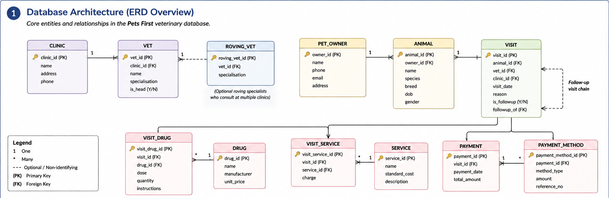
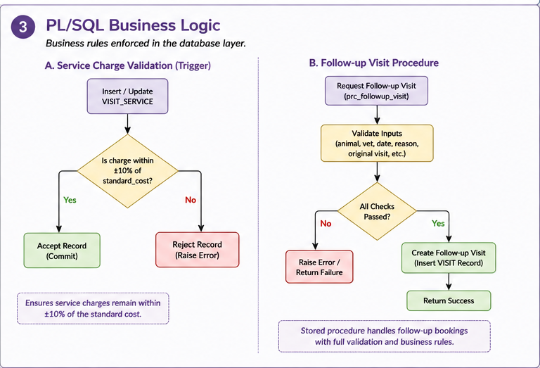
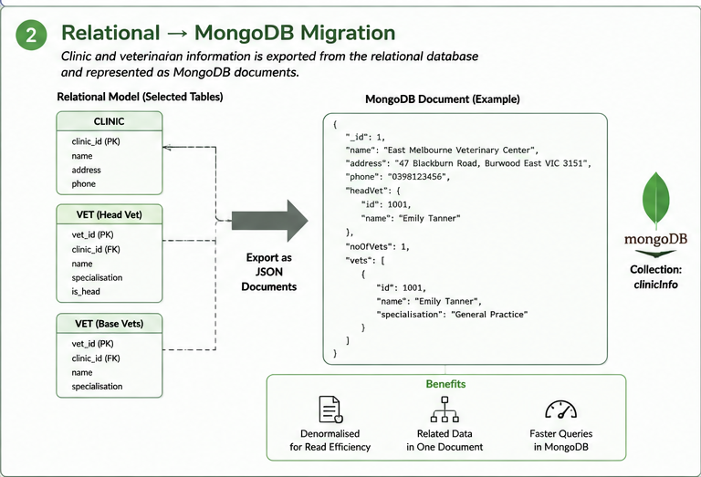

# Pets First — Relational Database Design & Implementation

A database engineering project for a multi-clinic veterinary practice, implemented using Oracle SQL, PL/SQL, and MongoDB.

## Overview

Designed and implemented a backend database system for **Pets First**, a veterinary practice operating across multiple clinics.

The system models clinics, veterinarians, pet owners, animals, visits, follow-up visits, drug prescriptions, services, and billing.

The project covers the database lifecycle from relational schema design and data population through transaction-safe operations, business-rule enforcement, schema evolution, and migration of selected relational data into MongoDB.

> **Note:** This project was completed as assessed coursework at Monash University Malaysia. The original source code and assessment submission are kept private in accordance with university assessment requirements. This repository provides a public overview of the project for internship and portfolio purposes.

---

## Database Architecture



The database was designed around the core entities and relationships required by a multi-clinic veterinary practice.

The relational model supports:

- Multiple veterinary clinics
- Veterinarians, including roving specialists
- Pet owners and animals
- Veterinary visits and follow-up visit chains
- Drug prescriptions
- Veterinary services and billing
- Payments and payment methods

The design uses primary keys, foreign keys, constraints, and relationships to maintain data integrity.

---

## What I Did

### Relational Database Design

Designed and implemented relational database components using **Oracle SQL**, including:

- Table definitions
- Primary and foreign key constraints
- Check constraints
- Referential integrity
- Data population
- Test data covering different clinic, vet, animal, visit, service, and prescription scenarios

The design was implemented to maintain consistency across related entities.

### Transaction-Safe Operations

Implemented database operations for:

- Booking veterinary visits
- Completing visits
- Cancelling bookings
- Creating follow-up visits

Oracle sequences were used for generated identifiers rather than relying on hardcoded keys, with transaction boundaries used to maintain consistency.

### Schema Evolution

Modified the running database to introduce additional business-tracked attributes and a multi-payment-method structure while preserving existing data.

This provided practical experience with evolving a database after its initial implementation rather than designing everything in isolation.

---

## PL/SQL Business Logic

PL/SQL was used to implement important business rules directly within the database layer.

### Service Charge Validation

A database trigger was implemented to automatically reject service charges outside **±10% of the standard service cost**.

This ensures that the business rule is enforced consistently at the database level.

### Follow-up Visit Procedure

A stored procedure, `prc_followup_visit`, was implemented to handle follow-up visit bookings.

The procedure includes:

- Input validation
- Follow-up visit creation
- Business-rule checks
- Success and failure test cases

### Business Logic Workflow



The trigger and stored procedure demonstrate how database-level logic can enforce business requirements independently of an application layer.

---

## MongoDB Integration

The project also explored migration from a relational representation to a **NoSQL document model**.

Selected clinic information was represented as JSON documents containing:

- Clinic details
- Head veterinarian information
- Veterinarian information
- Veterinary specialisations

The resulting documents were loaded into **MongoDB**, where queries and updates were performed on the collection.

### Relational → MongoDB



This demonstrated the differences between relational modelling and document-oriented data modelling, including how related information can be represented within a single MongoDB document.

---

## Technology Stack

`Oracle SQL` · `PL/SQL` · `MongoDB` · `Git`

---

## Skills Demonstrated

- Relational database design
- SQL
- DDL and DML
- Primary and foreign keys
- Referential integrity
- Database constraints
- Transactions
- Oracle sequences
- PL/SQL
- Database triggers
- Stored procedures
- Business-rule enforcement
- Schema evolution
- JSON document modelling
- MongoDB
- Relational-to-NoSQL migration
- Database testing

---

## Key Takeaways

This project provided practical experience across the full database development lifecycle:

**schema design → data population → transactions → business logic → schema evolution → NoSQL migration**

A key lesson was the importance of making early database design decisions with future changes in mind.

The project also demonstrated how database-level triggers and stored procedures can enforce business rules directly within the data layer rather than relying entirely on application code.

---

## Project Structure

```text
pets-first-database/
│
├── README.md
└── images/
    ├── database_architecture.png
    ├── relational_to_mongodb.png
    └── plsql_business_logic.png
